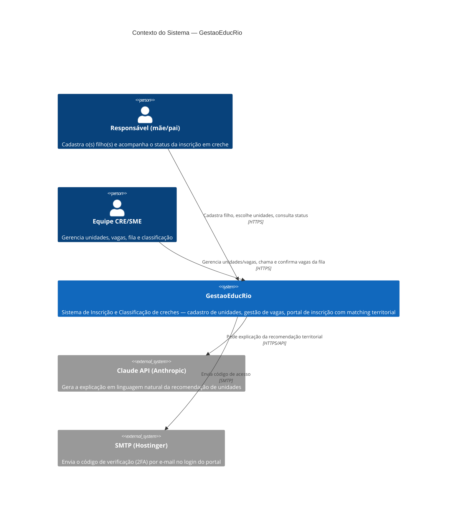
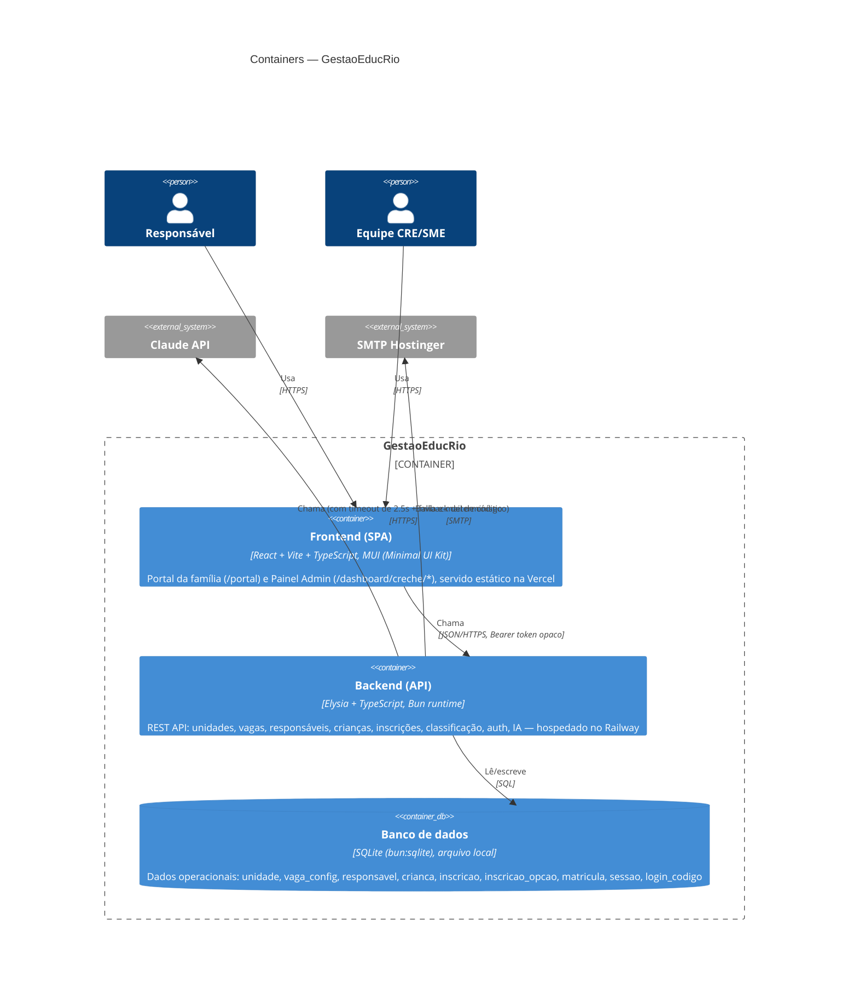
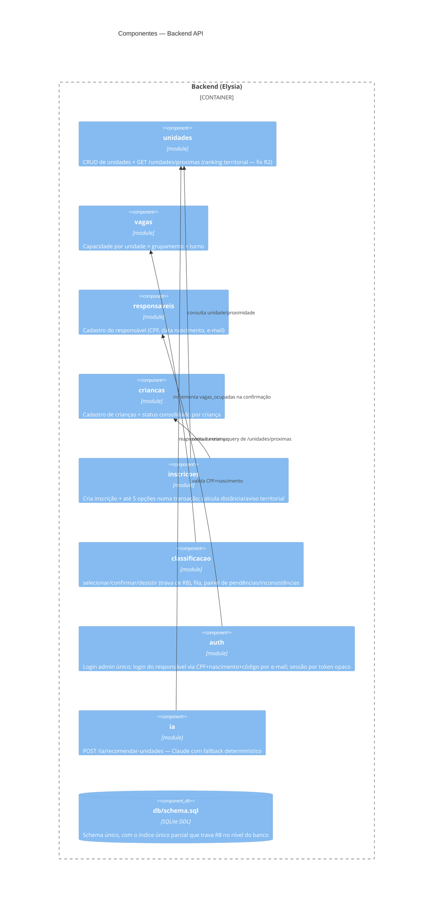

# Arquitetura — Modelo C4

> Documentação de arquitetura (C4 Model: Contexto → Container → Componente) do **GestaoEducRio**. Reflete o estado real do sistema implementado hoje (2026-08-30), não um plano futuro — atualizar conforme a arquitetura evoluir.

## Nível 1 — Diagrama de Contexto

Quem usa o sistema e com quais sistemas externos ele conversa.

**Fora do escopo deste sistema** (não integrado hoje): sistemas oficiais da Prefeitura (matricula.rio, Registro Municipal Integrado, CadÚnico) — o dataset histórico usado pra seed vem de um repositório de dados estático (`CIT-SME-RJ/dadoscreche`), não de uma integração ao vivo.

## Nível 2 — Diagrama de Container

Como o sistema se divide em unidades implantáveis.

**Por que SQLite, não Postgres**: decisão consciente pra hoje (ver `docs/desafio/backend-spec.md` §1) — zero infra externa, setup instantâneo, suficiente pras invariantes do domínio (`UNIQUE`/`CHECK`/índice único parcial). Se o projeto for adiante, migrar pra Postgres gerenciado no Railway é o próximo passo natural — o SQL é padrão o bastante pra portar sem reescrever a lógica de negócio.

## Nível 3 — Componentes do Backend

O container "Backend (API)" por dentro — um módulo por recurso de domínio, cada um com `routes.ts` (HTTP) + `service.ts` (regra de negócio + acesso a dado). Hoje CRUD direto, **não CQRS** (leitura e escrita no mesmo `service.ts` de cada módulo) — ver decisão registrada em `CLAUDE.md`.

## Decisões de arquitetura registradas (ADR-lite)

| Decisão | Alternativa considerada | Por quê |
|---|---|---|
| SQLite via `bun:sqlite`, sem ORM | Postgres gerenciado no Railway | Zero setup de infra externa; hackathon de 1 dia — reversível depois (ver nota acima) |
| CRUD por módulo (não CQRS) | Separar commands/queries desde já | Volume de código ainda pequeno o bastante pra não precisar da separação; reavaliar se o domínio crescer |
| Trava de R8 como índice único parcial no schema | Só checagem na aplicação | Garante o invariante mesmo sob condição de corrida — não depende de nenhum service "lembrar" de checar |
| IA com fallback determinístico obrigatório, timeout 2.5s | Deixar a chamada à IA bloquear a resposta | A demo não pode quebrar se a API do Claude falhar ou não tiver chave configurada |
| Sessão via token opaco em tabela `sessao` | JWT | Mais simples de revogar/expirar num MVP; sem necessidade de assinatura/verificação de JWT hoje |

## Notas de manutenção

- Gerado uma vez, ponto-no-tempo (2026-08-30). Se um módulo novo for adicionado ou um container mudar (ex.: trocar SQLite por Postgres), atualizar o diagrama correspondente — não deixar desatualizado.
- Fonte de verdade sobre endpoints/schema exatos: `backend/src/db/schema.sql` e `docs/desafio/backend-spec.md`. Este documento é a visão de arquitetura, não o dicionário de dados.
