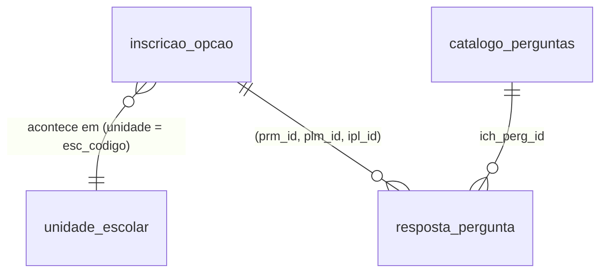

# Dicionário de Dados — Inscrição Creche (dataset oficial)

> Fonte: [`CIT-SME-RJ/dadoscreche`](https://github.com/CIT-SME-RJ/dadoscreche) (README + `Bases IC_ ClassificadoseFila/README_dicionario_dados.md`). Esta é a fonte **autoritativa e precisa** — mais exata que as descrições dos slides em `prefeitura-rio-creches.md`. Em caso de divergência de números, confiar neste arquivo.

## Onde clonar

```
git clone https://github.com/CIT-SME-RJ/dadoscreche.git
```

| Pasta/arquivo | Conteúdo |
|---|---|
| `Bases IC_ ClassificadoseFila/` | Inscrição/classificação (Query A–D) — o core do desafio |
| `OferecimentosEvagas/` | Vagas ofertadas por unidade pública/parceira, 2021–2025 |
| `Microáreas_SME_revisãoIPP/` | Shapefile de microáreas territoriais da SME/IPP — para mapas/geoprocessamento (útil no **Eixo 1**) |
| `NascidosvivosRJ.xlsx` | Nascidos vivos no município — proxy de demanda futura (útil no **Eixo 1**) |

## Escopo temporal

5 processos seletivos: **179 (2021), 181 (2022), 184 (2023), 194 (2024), 195 (2025)**. O processo vigente (2026) **não** está incluído.

## Formato dos arquivos

- Separador `;`, encoding **UTF-8 com BOM**.
- `01_QueryA` e `02_QueryB` vêm compactadas em `.gz` (limite de 100MB do GitHub). Conteúdo idêntico ao CSV cru — a maioria das libs lê `.gz` direto (`pd.read_csv(..., compression="infer")` funciona sem descompactar).
- **`02_QueryB` não abre no Excel**: 4.357.119 linhas > teto do Excel (1.048.576) → abriria truncado sem aviso. Usar Python/R/DuckDB.
- **`02_QueryB` exige leitura em chunks** (~vários GB se carregada inteira) — usar `chunksize=` no pandas ou DuckDB (lê `.gz` do disco sem carregar tudo na memória).
- **`04_UnidadesEscolaresComEndereco.csv` não tem cabeçalho** — ler com `header=None` e nomear colunas manualmente (ver snippet abaixo), senão a primeira unidade some e os nomes de coluna ficam inválidos.

## Modelo de dados (join keys)



- **Query A ↔ Query B**: chave `(prm_id, plm_id, ipl_id)`.
- **Query A ↔ Query D**: `unidade` (Query A) = `esc_codigo`, 2ª coluna (Query D) — casa 872/872.
- **Query B ↔ Query C**: `ich_perg_id` (muda a cada ano/processo — não confundir com `perg_id`, que é estável entre anos).

## Query A — `01_QueryA_InscricoesPorAno.csv.gz`

**Grão**: uma linha por opção de creche escolhida dentro de uma inscrição. 837.179 linhas, 343.308 inscrições distintas, 872 unidades.

| Coluna | Descrição | Gotcha |
|---|---|---|
| `ano` | Ano do processo (2021–2025) | |
| `prm_id`, `plm_id`, `ipl_id` | Processo → polo/lote → inscrição | chave composta hierárquica |
| `opcao` | Ordem da opção (1ª, 2ª...) | maioria até 5, mas **11 linhas com `opcao = 6`** |
| `unidade` / `nome_unidade` | Código/nome da unidade | junta com Query D |
| `grupamento` | Faixa etária (ex.: Berçário, Maternal) | |
| `horario` | `Integral` ou `Parcial` | |
| `data_criacao` | Data/hora da inscrição | |
| `aluno_anon` | Código anônimo da criança | **estável** entre opções e entre os 5 anos |
| `sexo_crianca` | `M` (439.690) / `F` (397.489) | sem nulos |
| `nascimento_aluno_anomes` | `yyyy-MM` | sem o dia (privacidade) |
| `responsavel_anon` | Código anônimo do responsável 1 | sem nulos na extração |
| `CEP`, `bairro` | Endereço do responsável | **nulo em 2,8%** das linhas (23.6xx) |
| `situacao` | Status da opção | ver tabela abaixo — **atenção à grafia** |

**Distribuição de `situacao`** (base **não vem pré-filtrada** — inclui todos os desfechos, inclusive cancelamentos, que são maioria):

| `situacao` | Linhas | % |
|---|---:|---:|
| `Cancelado pelo sistema` | 326.316 | 39,0% |
| `Confirmado` | 192.570 | 23,0% |
| `Lista de espera` | 178.731 | 21,3% |
| `Cancelado na confirmacao` | 118.816 | 14,2% |
| `Cancelado` | 18.722 | 2,2% |
| `Selecionado da lista` | 1.191 | 0,1% |
| `Ativo` | 606 | 0,1% |
| `Selecionado` | 227 | 0,0% |

⚠️ Valor gravado é literalmente `Cancelado na confirmacao` — **sem cedilha, sem til**. Filtrar por "confirmação" com acento devolve 0 linhas.

> `Cancelado pelo sistema` (39%) + `Cancelado na confirmacao` (14,2%) = **mais da metade das linhas são cancelamento** — dado direto para dimensionar o problema do Eixo 2 (escolhas inviáveis geograficamente viram cancelamento, não "falta de vaga").

## Query B — `02_QueryB_RespostasSocioEconomicas.csv.gz`

**Grão**: uma linha por pergunta respondida (formato longo). 4.357.119 linhas.

| Coluna | Descrição |
|---|---|
| `ano`, `prm_id`, `plm_id`, `ipl_id` | chave da inscrição (liga com Query A) |
| `ich_perg_id` | id da pergunta **nesse processo** (muda por ano — junta com Query C) |
| `pergunta_texto` | texto completo, sem nulos |
| `pergunta_legenda` | **sempre NULL (100%)** — ignorar, usar `pergunta_texto` |
| `pergunta_ordem` | ordem de exibição |
| `resposta` | `Sim`/`Nao`, sem nulos — 410.878 `Sim` (9,4%) |
| `confirmado` | `Sim`/`Nao`, sem nulos — 541.665 `Sim` (12,4%) |

Qualidade do join com Query A: só 221 de 4.357.119 linhas (Query B) sem inscrição correspondente; 8.162 de 343.308 inscrições (2,4%) sem nenhuma resposta.

## Query C — `03_QueryC_PerguntasComDescricao.csv`

**Grão**: uma pergunta por processo/ano. 65 linhas = 13 perguntas × 5 anos, 24 perguntas distintas no total.

| Coluna | Descrição |
|---|---|
| `ich_perg_id` | instância da pergunta naquele ano — junta com Query B |
| `perg_id` | id **estável** da pergunta entre anos — usar para comparar séries temporais |
| `perg_pontuacao` | **pontos que a pergunta vale na classificação** (0–100) |
| `perg_criterio` | `Sim` = critério de desempate (não soma pontos) — equivale a `perg_pontuacao = 0` (10 das 65 linhas) |

⚠️ **A régua de pontuação NÃO é comparável entre anos sem tratamento.** O questionário foi redesenhado entre 2023→2024: das 13 perguntas de 2023, só 3 sobreviveram em 2024, e os pesos mudaram — ex.: `perg_id = 2` ("a criança tem deficiência?") valia 100 pontos em 2021–2023 e caiu para 25 em 2024. **Qualquer série temporal ou modelo preditivo (Eixo 1) que ignore essa quebra de régua vai produzir resultado espúrio.**

## Query D — `04_UnidadesEscolaresComEndereco.csv`

**Sem cabeçalho.** 2.188 unidades, das quais 872 aparecem na Query A (as outras 1.316 são da rede mas não tiveram inscrição de creche nos 5 processos extraídos).

```python
import pandas as pd
d = pd.read_csv("04_UnidadesEscolaresComEndereco.csv", sep=";", header=None,
                encoding="utf-8-sig", na_values=["NULL"],
                names=["seq","esc_codigo","nome","tipo","logradouro",
                       "numero","complemento","bairro","cep"])
```

`seq` (posição 0) **não junta com nada** — é só um índice interno de 1 a 2.188. A chave real é `esc_codigo` (posição 1).

## Leitura recomendada (Python)

```python
import pandas as pd

# Query A — cabe em memória, tem cabeçalho, lê .gz direto
a = pd.read_csv("01_QueryA_InscricoesPorAno.csv.gz", sep=";", encoding="utf-8-sig")

# Query B — grande, ler em chunks ou usar DuckDB
import duckdb
b = duckdb.sql("SELECT * FROM read_csv_auto('02_QueryB_RespostasSocioEconomicas.csv.gz', delim=';')")

# Query C — pequena
c = pd.read_csv("03_QueryC_PerguntasComDescricao.csv", sep=";", encoding="utf-8-sig")

# Query D — sem cabeçalho, ver snippet acima
```

## Anonimização (mecanismo exato)

- `aluno_anon`: chave natural = CPF → (se vazio) DNV → (se vazio) NIS → (se vazio) nome normalizado + nascimento. **Mesmo código em todas as opções e nos 5 processos** em que a criança aparecer.
- `responsavel_anon`: chave natural = NIS → (se vazio) nome normalizado + nascimento.
- Recalculado a cada execução (não há tabela de mapeamento persistida) — determinístico e estável porque 2021–2025 são dados fechados/históricos.
- **34.486 crianças (13,3% de 259.924) reaparecem em mais de um ano**, rastreáveis pelo código estável — dá pra estudar reincidência na fila / abandono / comportamento multi-ano.

**⚠️ Aviso oficial do dataset:** indicadores absolutos gerados a partir dos dados **não representam a realidade** (passaram por aleatorização/generalização/supressão) — os dados só **ilustram dinâmicas**. Não tratar números absolutos como estatística oficial em nenhuma entrega/apresentação; falar em termos de padrões/proporções relativas é mais seguro.

## Dados complementares (menos documentados, explorar conforme necessidade)

- `OferecimentosEvagas/`: `Parceiras{2021..2025}.xlsx` (vagas ofertadas por unidades parceiras) + `totalalunoscreche{2021..2025}.xlsx` (total de alunos) + `Unidades_Unificadas_com_Localizacao.xlsx`. Tem um `LEIAME_OFERECIMENTOSPARCEIRASEPUBLICAS.txt` próprio — ler antes de usar.
- `Microáreas_SME_revisãoIPP/`: shapefile (`.shp`/`.dbf`/`.prj`/`.shx`) de microáreas territoriais — abrir com `geopandas` para cruzar bairro/CEP com território SME real (mapas de demanda por região, Eixo 1).
- `NascidosvivosRJ.xlsx`: nascidos vivos por região — proxy de demanda futura de vaga de creche (defasagem de ~1–4 anos entre nascimento e idade de creche), forte candidato a feature preditiva no Eixo 1.
